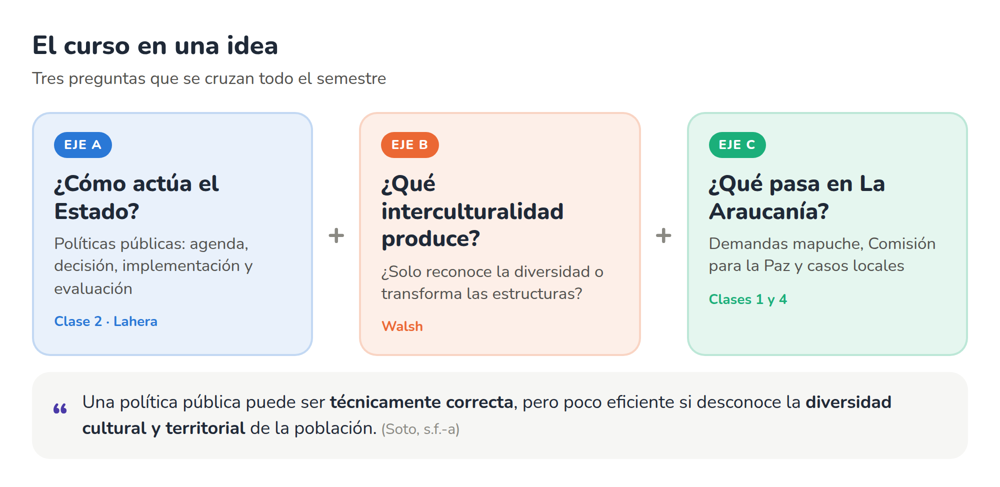
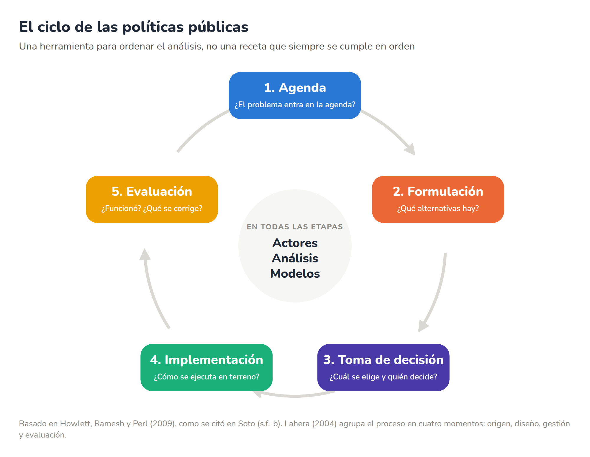
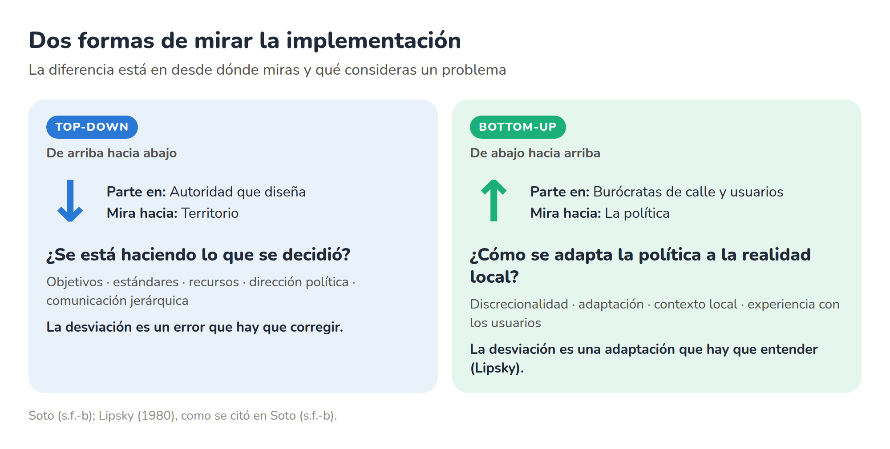
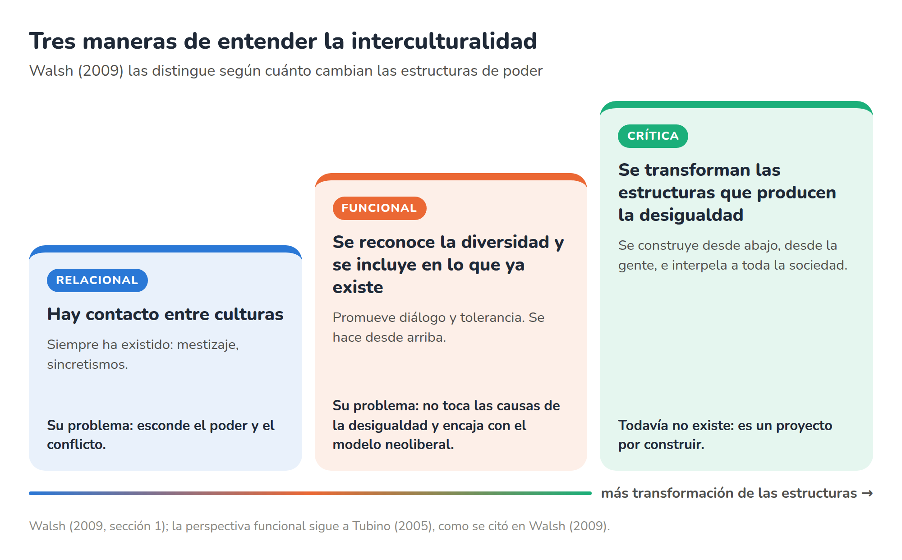
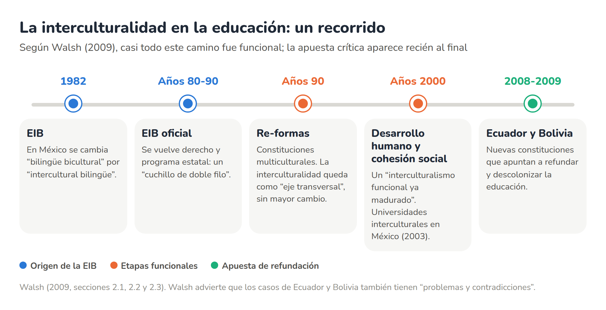
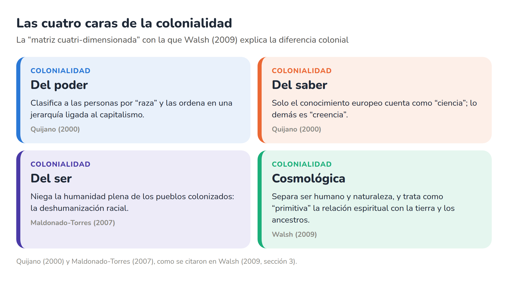
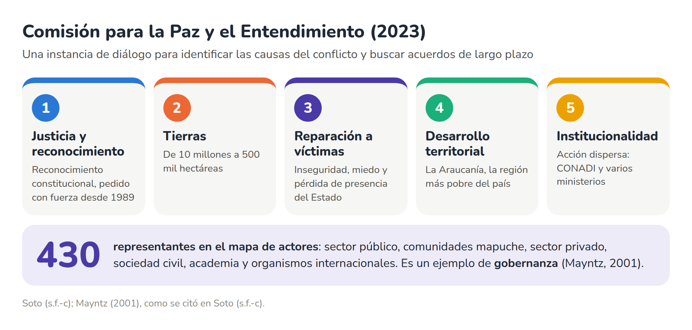
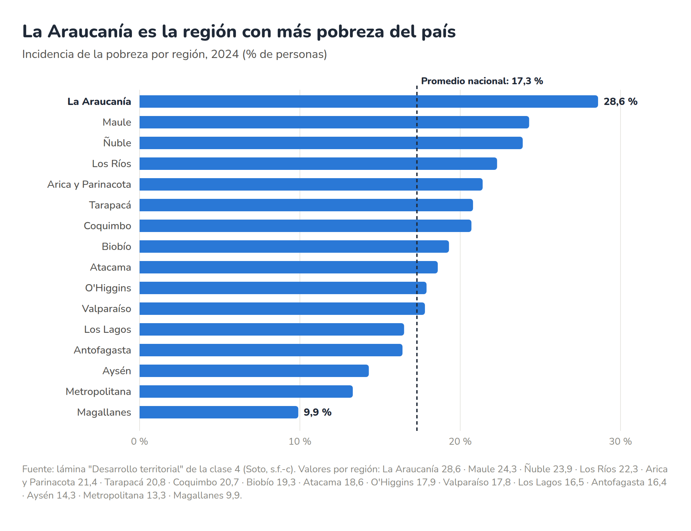
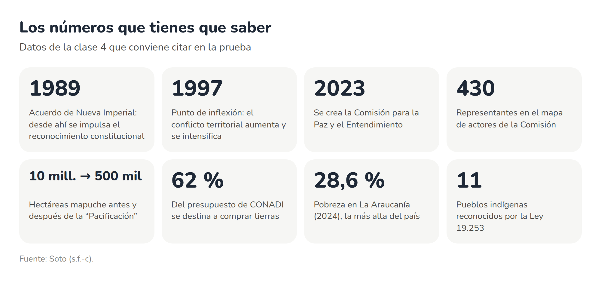

# Guía de estudio N.º 1: Gestión Pública Intercultural

*Todo lo que necesitas para la prueba, explicado simple.*

**Qué cubre:** políticas públicas, interculturalidad y las demandas actuales del pueblo mapuche.
**Con qué material:** las clases 1, 2 y 4 del profesor Jaime Soto, y las lecturas de Lahera (2004) y Walsh (2009).

<!-- pagebreak -->

## Antes de empezar

La guía tiene tres partes de contenido y una de práctica. Te recomiendo este orden:

1. Lee cada parte de corrido, sin tomar apuntes. Fíjate en los recuadros de colores.
2. Haz los casos de la Parte 4 **sin mirar las respuestas**. Después corrígete con la pauta.
3. La noche antes, repasa el glosario y el checklist final.

A lo largo de la guía vas a encontrar estos recuadros:

<!-- cards -->
| 💡 En simple | ⚠️ Ojo en la prueba | 📌 Para recordar | 🧩 Aporte del tutor |
| --- | --- | --- | --- |
| La idea explicada con palabras de todos los días. | Confusiones típicas que cuestan puntos. | Lo mínimo que tienes que saber de memoria. | Ejemplos y analogías míos que **no** están en tus lecturas. No se los atribuyas a los autores. |

> [!NOTE] Sobre las citas
> Todas las citas van en formato APA 7. Cuando dice "como se citó en", significa que conocemos a ese autor a través del material del curso. El texto de Walsh no tiene páginas numeradas, así que se cita por sección (por ejemplo, Walsh, 2009, sección 2.1).

<!-- pagebreak -->

# Parte 1 · Políticas públicas

## ¿Qué es una política pública?

Una política pública es lo que el Estado decide hacer (o no hacer) frente a un problema que la sociedad considera importante. En clase vimos dos definiciones que conviene conocer.

> [!IMPORTANT] Tamayo (1997)
> "El conjunto de objetivos, decisiones y acciones que lleva a cabo un gobierno para solucionar los problemas que, en un momento determinado, los ciudadanos y el propio gobierno consideran prioritarios" (Tamayo, 1997, p. 281, como se citó en Soto, s.f.-b).

> [!IMPORTANT] Lahera (2002)
> "Cursos de acción y flujos de información relacionados con un objetivo público definido en forma democrática", desarrollados por el sector público y, frecuentemente, con participación de la comunidad y el sector privado (Lahera, 2002, p. 4, como se citó en Soto, s.f.-b).

La diferencia entre ambas es útil para la prueba. Tamayo pone el foco en el **gobierno** y en lo que es **prioritario en un momento dado**. Lahera suma a la **comunidad y al sector privado**, y exige que el objetivo se defina **democráticamente**. Esa segunda definición abre la puerta a que los pueblos indígenas participen en el diseño.

> [!WARNING] Ojo con el año
> La diapositiva cita a Lahera (2002) con "objetivo **público**". En la lectura de 2004, Lahera usa "objetivo **político** definido en forma democrática" para describir una política pública *de excelencia* (Lahera, 2004, p. 8). Cualquiera sirve, pero cita el año que corresponde.

## Polity, politics y policy

En español usamos la palabra "política" para tres cosas distintas. El inglés las separa, y Lahera destaca que esa distinción es clara en inglés (Lahera, 2004, p. 7).

<!-- cards -->
| Polity | Politics | Policy |
| --- | --- | --- |
| **Las reglas del juego** | **El juego de poder** | **Lo que el Estado hace** |
| Normas e instituciones: Constitución, leyes, sistema electoral. | Actores que compiten, negocian y ejercen poder: partidos, coaliciones, grupos de interés. | Decisiones y acciones para resolver problemas públicos: planes, programas, proyectos. |
| *Pregunta:* ¿cuáles son las reglas? | *Pregunta:* ¿quién gana poder y cómo influye? | *Pregunta:* ¿qué hace el gobierno frente al problema? |
| *Ejemplo:* la Ley 19.253 o el reconocimiento constitucional. | *Ejemplo:* la negociación entre gobierno, partidos y organizaciones mapuche. | *Ejemplo:* el programa de compra de tierras de CONADI. |

*Fuente:* Howlett et al. (2009, como se citó en Soto, s.f.-b). Los ejemplos se construyeron con Soto (s.f.-c).

> [!TUTOR] Una analogía con el fútbol
> La *polity* es el reglamento. La *politics* es todo lo que pasa en la cancha y en el camarín para ganar. La *policy* es la jugada concreta que el equipo decide ejecutar.

> [!WARNING] Ojo en la prueba
> El reconocimiento constitucional se pelea en la *politics*, pero lo que cambia es la *polity* (las reglas del juego). Un programa de subsidios, en cambio, es *policy*.

## La política y las políticas públicas se necesitan

Lahera insiste en que política y políticas públicas se influyen mutuamente: "Quien quiere el gobierno, quiere políticas públicas" (Lahera, 2004, p. 8). Cuando una falta, aparece un problema distinto.

<!-- cards -->
| Política sin políticas públicas | Políticas públicas sin política |
| --- | --- |
| El sistema se dedica solo a repartirse el poder. | Se diseña sin considerar a los actores ni los apoyos. |
| Resultado: es "más demagógica, menos moderna" (Lahera, 2004, p. 8). | Resultado: "tienen un problema de diseño" y debilitan la gobernabilidad social (Lahera, 2004, p. 8). |

> [!NOTE] Para recordar
> "Dentro del gobierno no se puede olvidar la política y fuera del gobierno no se pueden olvidar las políticas públicas" (Lahera, 2004, p. 8). Y para reformar el Estado: "Primero la función, después el organigrama" (Lahera, 2004, p. 25).

## El ciclo de las políticas públicas

El ciclo ordena el análisis en cinco etapas. Lo importante es entender qué pasa en cada una y qué puede salir mal. Lahera llama **"fugas"** a esas fallas: en cada etapa hay diferencias entre lo que el modelo supone y lo que ocurre en la realidad (Lahera, 2004, p. 11).

### 1. Agenda

Es el momento en que un problema capta la atención de las autoridades y se reconoce como algo que el Estado debe atender. Los gobiernos priorizan según la urgencia y la viabilidad política y técnica, y muchos actores empujan para que su tema entre (Soto, s.f.-b).

**Qué puede fallar:** "No toda idea entra a la agenda" (Lahera, 2004, p. 12). Y no todos llegan con la misma fuerza, porque "la participación es un bien que se distribuye de manera muy heterogénea" (Lahera, 2004, p. 14).

### 2. Formulación

Se buscan y comparan alternativas para enfrentar un problema que ya está en la agenda. Aquí debería pesar más lo técnico que lo político: evidencia, datos, experiencia comparada y **mecanismos de legitimidad** (Soto, s.f.-b).

**Qué puede fallar:** el diseño puede ignorar los aspectos institucionales o la evaluación. Sus orientaciones pueden quedar como "meras declaraciones, sin apoyo financiero o de personal" (Lahera, 2004, p. 12).

### 3. Toma de decisión

Se elige una alternativa. Deciden los actores políticos, pero los técnicos influyen con su conocimiento: es una coproducción. El riesgo es la **"caja cerrada"**, cuando se decide sin transparencia y por intereses ajenos a la evidencia (Soto, s.f.-b).

Para Lahera, una política se acepta cuando coinciden tres cosas: "la preocupación social, la existencia de una solución técnica y el apoyo político" (Lahera, 2004, p. 11).

### 4. Implementación

Las decisiones se convierten en acciones concretas. Es la etapa más difícil de controlar: una buena formulación no garantiza una buena ejecución, y **los implementadores no son neutros** (Soto, s.f.-b). Más adelante la vemos en detalle.

### 5. Evaluación

Se revisa si la política funcionó y qué hay que corregir. Lahera advierte que en América Latina la evaluación es "una actividad casi inexistente" (Lahera, 2004, p. 23). Cuando existe, puede ser parcial, hecha a la medida o concentrarse en las políticas menos importantes (Lahera, 2004, p. 12).

> [!WARNING] Ojo en la prueba
> Las etapas **no** siempre ocurren en orden. Para Lahera, "no necesariamente se dan en etapas causales y consecutivas, sino que en momentos analíticos de calidad y duración heterogéneas" (Lahera, 2004, p. 11). El ciclo es una herramienta para analizar, no una receta.

> [!NOTE] Para recordar
> El ciclo de clase tiene 5 etapas: agenda, formulación, toma de decisión, implementación y evaluación (Howlett et al., 2009, como se citó en Soto, s.f.-b). Lahera usa 4 momentos: origen, diseño, gestión y evaluación (Lahera, 2004).

## Ventanas de oportunidad

Una ventana de oportunidad es el momento en que se abre la posibilidad de que un tema avance. Lahera lo dice así: la oportunidad "es previsible, a veces […] Otras veces ella se abre de manera impredecible". Por eso hay que tener las "propuestas regalonas listas" (Lahera, 2004, p. 11).

<!-- cards -->
| Rutina | Discrecional | Aleatoria | Expansión |
| --- | --- | --- | --- |
| **Son previsibles.** Se abren con los procedimientos de siempre. | **Dependen de una autoridad.** Alguien decide impulsar algo. | **Llegan por sorpresa.** Son las menos predecibles. | **Una ventana abierta arrastra otros temas.** |
| Elecciones, discusión del presupuesto, evaluación periódica de programas. | Un ministro impulsa una reforma o el presidente anuncia una política. | Terremotos, pandemias, crisis económicas. | El estallido social. |

*Fuente:* Soto (s.f.-b).

## ¿Es viable? Tres preguntas de factibilidad

Antes de decidir, conviene revisar tres tipos de factibilidad (Soto, s.f.-b):

- **Técnica y económica:** ¿se puede implementar, organizar los recursos y evaluar su impacto?
- **Política:** ¿hay apoyo suficiente para aprobarla?
- **Jurídica:** ¿es compatible con las leyes vigentes? En temas indígenas, por ejemplo, con la Ley 19.253 y el Convenio 169 de la OIT.

### Las 11 características de una política de excelencia

Lahera propone 11 características (Lahera, 2004, p. 9, Recuadro 1). Son más fáciles de recordar agrupadas:

<!-- cards -->
| Idea y rumbo | Costos y beneficios | Coherencia | Viabilidad y medición |
| --- | --- | --- | --- |
| Fundamentación amplia: ¿cuál es la idea?, ¿a dónde vamos? | Costos y alternativas de financiamiento. | Consistencia interna y con otras políticas. | Apoyos y críticas probables. |
| Claridad de objetivos. | Evaluación costo-beneficio social. | Lugar en la secuencia: ¿qué va primero? | Oportunidad política. |
| | Beneficio comparado con otras políticas: ¿qué es prioritario? | Funcionalidad de los instrumentos. | Indicadores: costo unitario, economía, eficacia y eficiencia. |

> [!TIP] En simple
> Cumplir las 11 características no asegura que la política sea buena en su contenido. Lahera reconoce que las políticas suelen ser un *second best*: la mejor opción posible, no la ideal, que a veces ni siquiera existe (Lahera, 2004, p. 9).

## ¿Cómo se toman las decisiones?

En clase vimos tres modelos. La pregunta de fondo es cuánta información y cuánto orden tiene quien decide (Soto, s.f.-b).

<!-- cards -->
| Modelo racional | Racionalidad limitada | Cubo de basura |
| --- | --- | --- |
| Se analiza todo y se elige **la mejor opción**: la que da más beneficios con menos costos. | No hay tiempo, capacidad ni información para encontrar la mejor. Se elige **una que sea suficiente**. | Las decisiones salen del **encuentro casi al azar** entre problemas, soluciones, personas y oportunidades. |
| Pasos: definir objetivos, identificar alternativas, analizar costos y elegir. | Objetivos y medios se van ajustando entre sí sobre la marcha. | Las personas cambian, sus intereses también, y las oportunidades aparecen desordenadas. |
| **Crítica:** es poco realista, porque supone capacidades ilimitadas. | **A favor:** reconoce los límites de quien decide. | Lahera lo considera un enfoque "que exagera la desarticulación" (Lahera, 2004, p. 11). |

Lahera resume el cubo de basura así: "soluciones buscando temas para los que puedan ser la respuesta, y tomadores de decisiones buscando trabajo" (Cohen et al., 1972, como se citó en Lahera, 2004, p. 11).

> [!TUTOR] Tres analogías para no olvidarlos
> **Racional:** comprar un auto después de comparar todos los modelos del mercado en una planilla. **Limitada:** comprar el primero que cumple lo básico y está dentro del presupuesto. **Cubo de basura:** en una reunión de curso alguien trae una idea para la fiesta, justo se suma otro con una rifa y termina aprobándose lo que estaba sobre la mesa ese día.

> [!QUESTION] Pregunta que dejó el profesor
> ¿Qué modelo de toma de decisión han mostrado los gobiernos en materia de interculturalidad? (Soto, s.f.-b). Para responderla, elige un modelo y respáldalo con un caso. Por ejemplo, la compra de tierras de 1993 a 2024 fue muy irregular (Soto, s.f.-c). Eso permite plantear la hipótesis de decisiones de racionalidad limitada o de cubo de basura, más que de un plan racional.

> [!TUTOR] Incremental o no incremental
> En la lámina de formulación aparecen estas dos palabras. Una política **incremental** ajusta de a poco lo que ya existe. Una **no incremental** propone un cambio de fondo. Lahera apoya la primera idea cuando dice que "las políticas rara vez se extinguen por completo; es más habitual que cambien o se combinen con otras" (Lahera, 2004, p. 11).

## La implementación: top-down y bottom-up

La clase 2 destaca cuatro rasgos de la implementación (Soto, s.f.-b):

1. Las ideas, leyes y lineamientos se vuelven acciones concretas.
2. Es una etapa compleja: una buena formulación **no garantiza** una buena ejecución.
3. Participa una red de actores, a veces con parte del trabajo externalizado.
4. Los implementadores no son neutros: sus prácticas y resistencias pueden cambiar la política.

> [!TIP] En simple
> El enfoque **top-down** pregunta si se está cumpliendo lo que se decidió arriba. El enfoque **bottom-up** pregunta cómo la gente que atiende en terreno (los "burócratas de calle") adapta la política a la realidad local (Lipsky, 1980, como se citó en Soto, s.f.-b).

Lahera agrega un dato humano: si las reformas no se hacen de forma integral, los funcionarios "considerarán que los cambios son para perjudicarlos" (Lahera, 2004, p. 12).

## La participación ciudadana, según Lahera

Lahera dedica bastante espacio a la participación, y sirve mucho para argumentar en temas interculturales.

- **Tiene niveles:** compartir información, hacer consultas, participar en las decisiones y participar en la implementación (Lahera, 2004, p. 18).
- **Ayuda a la gestión:** mejora la información sobre las necesidades locales, adapta los programas, mejora la calidad de los servicios y moviliza recursos locales (Lahera, 2004).
- **También tiene riesgos:** puede ser manipulada por quien la organiza, provocar una "avalancha" de demandas, aumentar los costos iniciales o ser capturada por élites locales (Lahera, 2004).
- **La evaluación también puede ser participativa.** La evaluación interactiva analiza un programa a partir de la interacción entre usuarios, técnicos y directivos (Lahera, 2004, p. 23).

<!-- pagebreak -->

# Parte 2 · Interculturalidad

## Tres maneras de entender la interculturalidad

Catherine Walsh parte de una idea incómoda: desde los años 90 la interculturalidad está "de moda" en las políticas públicas, pero no todos la entienden igual. Distingue tres perspectivas (Walsh, 2009, sección 1).

### Relacional

Es la idea más básica: hay contacto e intercambio entre culturas. Desde esta mirada, la interculturalidad "siempre ha existido" en América Latina, por el mestizaje y los sincretismos.

**Su problema:** "oculta o minimiza la conflictividad y los contextos de poder" (Walsh, 2009, sección 1). Deja fuera las estructuras que ponen a unas culturas por encima de otras.

### Funcional

Reconoce la diversidad y busca **incluirla dentro de la estructura social que ya existe**. Promueve el diálogo, la convivencia y la tolerancia.

**Su problema:** no toca las causas de la desigualdad y tampoco "cuestiona las reglas del juego". Por eso es "perfectamente compatible con la lógica del modelo neo-liberal existente" (Tubino, 2005, como se citó en Walsh, 2009, sección 1). Walsh va más lejos: este reconocimiento puede volverse "una nueva estrategia de dominación", que sirve para controlar el conflicto étnico y mantener la estabilidad (Walsh, 2009, sección 1).

### Crítica

Parte de otro problema: la diferencia se construyó dentro de una **matriz colonial de poder**, racializada y jerárquica. Busca transformar las estructuras, las instituciones y las relaciones sociales. Se construye **desde la gente**, como demanda de los grupos subordinados, y no desde arriba (Walsh, 2009, sección 1).

Además, interpela a **toda** la sociedad, incluidos los "blanco-mestizos occidentalizados". Y todavía "aún no existe, es algo por construir" (Walsh, 2009, sección 1).

> [!TIP] En simple
> La interculturalidad funcional **invita a los pueblos indígenas a la mesa que ya existe**. La crítica **pregunta quién armó esa mesa y propone construir otra entre todos**.

> [!WARNING] Ojo en la prueba
> La diferencia entre funcional y crítica **no** está en si hay reconocimiento. Las dos reconocen la diversidad. La diferencia está en si se **transforman las estructuras** y en si el proceso viene **desde arriba o desde abajo**.

## La prueba de fuego: ¿funcional o crítica?

Cuando te pregunten si una política o institución es "declaración o práctica efectiva" (Soto, s.f.-a), hazle estas cuatro preguntas:

1. **¿Quién la diseñó?** Si fue solo la autoridad, sin las comunidades, apunta a funcional.
2. **¿Cambia algo de la estructura?** Si agrega un elemento (un facilitador, una señalética) sin cambiar cómo funciona la institución, apunta a funcional.
3. **¿A quién le habla?** Si solo se dirige a los pueblos indígenas y no a funcionarios ni al resto de la sociedad, apunta a funcional.
4. **¿Reconoce otros saberes como conocimiento?** Si trata los saberes indígenas como folclor y no como conocimiento válido, apunta a funcional.

Cuantas más respuestas apunten a lo contrario, más se acerca a la interculturalidad crítica.

## La interculturalidad en la educación

Walsh revisa cómo se ha usado la interculturalidad en la educación latinoamericana (Walsh, 2009, secciones 2.1 a 2.3).

**La educación intercultural bilingüe (EIB)** nace en los 80 con un doble sentido. Por un lado, es una demanda indígena. Por otro, cuando el Estado la oficializa (con el respaldo del Convenio 169 de la OIT), se vuelve parte del aparato de control. Walsh lo llama "un cuchillo de doble filo": hay un reconocimiento merecido, pero se debilita lo propio (Walsh, 2009, sección 2.1). Además, funciona en una sola dirección: "desde la lengua indígena hacia la lengua 'nacional'" (Walsh, 2009, sección 2.1).

**Las re-formas de los 90** reconocen en las constituciones el carácter multiétnico y pluricultural de los países. Fueron fruto de las luchas indígenas, pero también del proyecto neoliberal, que "incluye" para apaciguar. La interculturalidad queda como "eje transversal" sin cambiar el sistema educativo (Walsh, 2009, sección 2.2).

**En el siglo XXI** aparecen dos caminos. Uno ligado al "desarrollo humano integral" y a la cohesión social, que Walsh llama un "interculturalismo funcional ya madurado" (Walsh, 2009, sección 2.3). El otro busca una educación intercultural para todos, aunque a menudo se sigue asociando solo con lo indígena. Por ejemplo, Walsh pregunta por qué las universidades interculturales de México no se llaman "indígenas" en vez de "interculturales" (Walsh, 2009, sección 2.3).

**Ecuador (2008) y Bolivia (2009)** plantean en sus nuevas constituciones refundar y descolonizar la educación. Bolivia habla de una educación "intracultural, intercultural y plurilingüe"; Ecuador reconoce los saberes ancestrales y el *sumak kawsay* o buen vivir (Walsh, 2009, sección 2.3). Walsh pide no idealizarlos, porque también tienen "problemas y contradicciones".

> [!TUTOR] ¿Por qué "re-formas" con guion?
> Walsh lo explica en una nota: poner el guion enfatiza que esos cambios "no hicieron más que re-formular (o re-formar) lo mismo" (Walsh, 2009, nota 4).

## Las cuatro caras de la colonialidad

Para Walsh, la interculturalidad crítica tiene que ser **de-colonial**, porque la desigualdad viene de una "matriz" colonial que sigue funcionando (Walsh, 2009, sección 3).

La idea central es que la diferencia colonial no es solo cultural ni solo de clase. La raza, el racismo y la racialización son "elementos constitutivos y fundantes de las relaciones de dominación y del capitalismo mismo" (Walsh, 2009, sección 3).

> [!TUTOR] Cómo se ve en la gestión pública
> **Poder:** quién ocupa los cargos de decisión y quién aparece siempre como "beneficiario". **Saber:** si un hospital trata la medicina mapuche como conocimiento o solo como "creencia". **Ser:** un trato institucional que infantiliza o estigmatiza. **Cosmológica:** proyectos que pasan por encima de espacios sagrados.

## Tres palabras de Walsh que conviene entender

- **De-colonial (sin la "s"):** no es un anglicismo. Walsh no busca "deshacer" lo colonial, porque sus huellas no desaparecen. Busca una postura permanente de "transgredir, intervenir, in-surgir e incidir" (Walsh, 2009, nota 25).
- **Modos "otros":** no son "otros modos" ni "modos alternativos". Son formas de pensar, saber y vivir que nacen de la experiencia de la diferencia colonial (Walsh, 2009, nota 22).
- **Pedagogía de-colonial:** una práctica educativa que cuestiona la racialización y abre espacio a esos modos "otros" de ser, saber y vivir (Walsh, 2009, sección 3).

<!-- pagebreak -->

# Parte 3 · Casos de La Araucanía

## ¿Declaración o práctica efectiva?

La clase 1 abrió con esa pregunta y dos casos de la región (Soto, s.f.-a):

- **Padre Las Casas**, que se presenta como "Capital intercultural de Chile" y firmó una alianza estratégica con las universidades estatales de la región.
- **El Hospital Intercultural de Nueva Imperial**, reconocido, junto con el Hospital de Temuco, entre los mejores del mundo en un ranking internacional.

Para analizarlos, usa la prueba de fuego de la Parte 2. Tus materiales no traen detalles de cómo funcionan por dentro, así que en la prueba plantea tu juicio como hipótesis y di qué evidencia necesitarías para confirmarlo.

## La Comisión para la Paz y el Entendimiento

La Comisión se creó en 2023 como una instancia de diálogo con el pueblo mapuche y otros actores. Su tarea es identificar las causas estructurales del conflicto y avanzar hacia acuerdos de largo plazo (Soto, s.f.-c).

> [!TIP] Gobernanza, en simple
> Es cuando el Estado no decide solo, sino en cooperación con actores privados y sociales. Mayntz la define como "formas cooperativas de dirección, en las cuales el Estado interactúa con actores privados y sociales para producir decisiones y políticas" (Mayntz, 2001, como se citó en Soto, s.f.-c). La Comisión la puso en práctica con un mapa de 430 representantes.

### Los cinco ejes, uno por uno

**1. Justicia y reconocimiento.** El Estado ha reconocido algunos daños históricos, pero muchas personas sienten que no ha sido suficiente. La demanda principal es el **reconocimiento constitucional**, que se impulsa con fuerza desde el **Acuerdo de Nueva Imperial (1989)**. La clase comparó cómo "el lenguaje construye realidades" en Canadá, con sus Primeras Naciones, y en Chile con el pueblo mapuche (Soto, s.f.-c).

**2. Tierras.** Antes de la colonia, el territorio mapuche llegaba hasta el río Aconcagua; después, hasta el Biobío. Con la "Pacificación de la Araucanía" se redujo de **10 millones a 500 mil hectáreas**. Hoy, cerca del **62 % del presupuesto de CONADI** se destina a comprar tierras (Soto, s.f.-c).

**3. Reparación a las víctimas.** El año **1997** se considera un punto de inflexión: los conflictos territoriales aumentaron y se volvieron más intensos. Hay miedo, desconfianza y pérdida de presencia del Estado. Algunas medidas se consideran insuficientes, como el acceso preferente a subsidios habitacionales del PAVVR (Soto, s.f.-c).

**4. Desarrollo territorial.** La Araucanía tiene la pobreza más alta del país. La clase dejó dos preguntas abiertas: ¿qué pasa con la pobreza multidimensional? y ¿es una realidad alejada? (Soto, s.f.-c).

**5. Institucionalidad.** La acción del Estado está **dispersa**. CONADI debe coordinar con el Ministerio de Desarrollo Social, el MOP, el MINEDUC, el MINSAL, el MINVU y otros organismos. Además, la Ley 19.253 reconoce hoy a **11 pueblos indígenas** (Soto, s.f.-c).

<!-- pagebreak -->

# Parte 4 · Practica como en la prueba

## Un método para cualquier caso

Usa estos cuatro pasos en cualquier pregunta de desarrollo:

1. **Identifica** qué concepto te están pidiendo.
2. **Define** ese concepto, con su autor y su cita.
3. **Aplícalo** al caso usando datos del enunciado.
4. **Concluye** con tu postura y una limitación.

La pauta de cada caso tiene tres niveles. **Logrado:** el concepto es preciso, está bien aplicado y tiene cita. **Parcial:** falta la cita, la aplicación o el rasgo que distingue al concepto. **Inicial:** la idea es vaga o está mal usada.

## Caso 1 · El "Plan Comunal Intercultural"

*Tiempo sugerido: 20 minutos.*

> [!EXAMPLE] Enunciado (caso ficticio)
> La Municipalidad de "Villa Araucana", en una comuna con mucha población mapuche, lanza su "Plan Comunal Intercultural". Incluye señalética bilingüe en mapuzugun y castellano, financia la celebración del *We Tripantu* y contrata un facilitador intercultural para el CESFAM. El Departamento de Cultura lo diseñó en dos meses, sin participación de las comunidades. Tiene presupuesto por un año y no define indicadores. El alcalde dice que la comuna es "referente de interculturalidad".
>
> **a)** Clasifica el plan según Walsh (2009). **b)** Identifica dos "fugas" según Lahera (2004). **c)** Propón tres cambios para acercarlo a una interculturalidad crítica.

### Respuesta modelo

**a) Clasificación.** El plan es un caso de interculturalidad **funcional**. Reconoce y hace visible la cultura mapuche, pero:

- se diseñó desde arriba, sin las comunidades;
- no cambia ninguna estructura: el facilitador se agrega al CESFAM sin cambiar cómo se organiza la atención;
- solo se dirige a lo mapuche, no a los funcionarios ni al resto de la comuna.

Encaja con lo que Walsh describe: no toca las causas de la desigualdad y tampoco "cuestiona las reglas del juego" (Tubino, 2005, como se citó en Walsh, 2009, sección 1).

**b) Fugas.** La primera es de **diseño**: sin indicadores ni presupuesto estable, sus orientaciones corren el riesgo de ser "meras declaraciones, sin apoyo financiero o de personal" (Lahera, 2004, p. 12). La segunda es de **evaluación**: sin indicadores, la evaluación "puede simplemente no existir" (Lahera, 2004, p. 12).

**c) Tres cambios.**

1. **Participación real:** que las comunidades participen en las decisiones y la implementación, no solo que se les informe (Lahera, 2004, p. 18).
2. **Cambio estructural:** por ejemplo, un modelo de co-gestión con las organizaciones, como el que Walsh describe para la educación bilingüe en Ecuador (Walsh, 2009, nota 7). También formación intercultural para **todo** el personal municipal, porque el tema no es solo de los pueblos indígenas (Walsh, 2009, sección 1).
3. **Otros saberes e indicadores:** reconocer los saberes de salud mapuche como conocimiento (Walsh, 2009, sección 3) y medir resultados con indicadores (Lahera, 2004, p. 9).

**Conclusión.** Hoy el plan es más **declaración** que práctica. Solo sería práctica efectiva si comparte el poder de decisión y cambia estructuras. Una limitación: para Walsh la interculturalidad crítica se construye desde abajo, así que un municipio no puede decretarla. Sí puede abrir las condiciones para que ocurra (Walsh, 2009, sección 1).

## Caso 2 · La compra de tierras

*Tiempo sugerido: 20 minutos.*

> [!EXAMPLE] Enunciado
> Cerca del 62 % del presupuesto de CONADI se destina a comprar tierras. Entre 1993 y 2024 los montos fueron muy irregulares: hay años cercanos a 16.000 o 19.000 hectáreas y otros con compras mínimas (Soto, s.f.-c).
>
> **a)** ¿Es *polity*, *politics* o *policy*? **b)** Plantea dos hipótesis sobre la irregularidad usando modelos de decisión y ventanas de oportunidad. **c)** Propón tres indicadores de evaluación.

### Respuesta modelo

**a)** Es *policy*: una acción concreta del Estado frente a un problema público, la pérdida de tierras (Howlett et al., 2009, como se citó en Soto, s.f.-b). Se relaciona con la *polity* porque funciona bajo la Ley 19.253, y con la *politics* porque depende de la disputa por el presupuesto.

**b)** El material no explica las causas, así que conviene hablar de hipótesis.

- **Hipótesis 1:** los años con más compras podrían coincidir con discusiones presupuestarias favorables (ventana de rutina) o con prioridades de un gobierno (ventana discrecional) (Soto, s.f.-b).
- **Hipótesis 2:** sin un plan de largo plazo, las compras podrían depender de los predios en venta y los recursos de cada año. Eso se parece al cubo de basura, donde las soluciones "buscan" problemas (Cohen et al., 1972, como se citó en Lahera, 2004, p. 11), o a la racionalidad limitada, donde se elige lo suficiente con la información disponible (Soto, s.f.-b).

**c)** Tres indicadores, siguiendo a Lahera (2004, p. 9):

1. **Costo por hectárea** traspasada (costo unitario).
2. **Porcentaje de demandas territoriales priorizadas que se resolvieron** (eficacia).
3. **Uso productivo o cultural de las tierras cinco años después**, medido junto con las comunidades. Responde a la advertencia de que es posible que "se gasten más recursos sin que los resultados mejoren" (Lahera, 2004, p. 12).

**Conclusión.** Una política que usa cerca del 62 % del presupuesto de la institución, sin evaluación sistemática, confirma que en la región la evaluación es "una actividad casi inexistente" (Lahera, 2004, p. 23).

> [!TUTOR] Una pregunta para ir más allá
> Desde Walsh, cabe preguntarse si comprar tierras, sin un reconocimiento más amplio, repara el daño o solo administra el conflicto.

## Caso 3 · La Comisión para la Paz y el Entendimiento

*Tiempo sugerido: 15 minutos. Es la pregunta 11 del diagnóstico.*

> [!EXAMPLE] Enunciado
> La Comisión para la Paz y el Entendimiento se creó en 2023 para dialogar con el pueblo mapuche y otros actores, identificar las causas estructurales del conflicto y avanzar hacia acuerdos de largo plazo. Su mapa de actores tiene 430 representantes.
>
> **a)** ¿En qué etapa del ciclo se ubica su trabajo? **b)** ¿Por qué es un ejemplo de gobernanza? **c)** Elige un eje y anticipa un problema de implementación.

### Respuesta modelo

**a)** Su **creación** marca un momento de **agenda**: el conflicto se reconoce como un asunto que el Estado debe atender. Su **trabajo** corresponde a la **formulación**, porque analiza causas y propone alternativas (Soto, s.f.-b). No decide ni ejecuta. Aun así, Lahera recuerda que las etapas no son estrictamente consecutivas (Lahera, 2004, p. 11), y por eso la Comisión también anticipa temas de implementación, como la institucionalidad.

**b)** Cumple la definición de Mayntz: el Estado dirige en cooperación con actores privados y sociales (Mayntz, 2001, como se citó en Soto, s.f.-c). La evidencia son los 430 representantes de seis sectores. Además, le da a la formulación "mecanismos de legitimidad" (Soto, s.f.-b).

**c)** Eje **institucionalidad**, mirado desde el enfoque **top-down**: la acción del Estado está dispersa entre CONADI y varios ministerios (Soto, s.f.-c). Sin una dirección política clara ni comunicación jerárquica, lo que se acuerde puede quedar lejos de lo que se ejecute (Soto, s.f.-b).

Otra opción: eje **reparación**, mirado desde el enfoque **bottom-up**. Los funcionarios que asignan los subsidios del PAVVR tienen margen de decisión. Si no hay criterios adaptados al contexto local, la medida seguirá siendo "insuficiente" (Soto, s.f.-c; Lipsky, 1980, como se citó en Soto, s.f.-b).

## Caso 4 · Preguntas cortas

*Tiempo sugerido: 4 minutos por pregunta. Responde en 4 a 6 líneas.*

**¿Por qué Walsh dice que la oficialización de la EIB fue "un cuchillo de doble filo"?**

> [!TIP] Respuesta modelo
> Porque al volverse un derecho y un programa estatal *para* indígenas, respaldado por el Convenio 169 de la OIT, la EIB obtuvo un reconocimiento merecido. Pero también entró al aparato de control del Estado: se debilitó su sentido comunitario y ancestral y aparecieron mecanismos de regulación. Además, funcionaba en una sola dirección, de la lengua indígena a la "nacional" (Walsh, 2009, sección 2.1).

**Explica "primero la función, después el organigrama" y aplícalo a la institucionalidad indígena.**

> [!TIP] Respuesta modelo
> Para Lahera, la reforma del Estado "debe hacerse en torno a decisiones de políticas públicas": importan los resultados más que la estructura (Lahera, 2004, pp. 8 y 25). Antes de crear o fusionar organismos, habría que definir qué funciones debe cumplir el Estado con los pueblos indígenas. Recién después conviene decidir el diseño de las instituciones, que hoy está disperso entre CONADI y varios ministerios (Soto, s.f.-c).

**Diferencia la interculturalidad funcional de la crítica en tres aspectos.**

> [!TIP] Respuesta modelo
> Origen: la funcional se hace desde arriba y la crítica se construye desde la gente. Relación con el poder: la funcional no toca las causas de la desigualdad y la crítica parte del problema estructural-colonial-racial. Objetivo: la funcional busca incluir en lo que existe y la crítica, transformarlo (Walsh, 2009, sección 1; Tubino, 2005, como se citó en Walsh, 2009, sección 1).

**¿Por qué el modelo racional es "poco realista" y qué propone la racionalidad limitada?**

> [!TIP] Respuesta modelo
> Porque supone que quien decide tiene capacidad ilimitada para definir objetivos, conocer todas las alternativas y elegir la óptima. La racionalidad limitada reconoce que faltan tiempo, información y capacidad, así que se elige una solución suficiente, y los objetivos y los medios se ajustan entre sí (Soto, s.f.-b).

## Respuestas del diagnóstico

1. **b) Politics.** La pregunta por quién obtiene el poder es la de la política como actividad (Howlett et al., 2009, como se citó en Soto, s.f.-b).
2. **d) Expansión.** La ventana ya estaba abierta y sumó otros temas. La clase usa el estallido social como ejemplo (Soto, s.f.-b). "Aleatoria" describe una crisis inesperada, no la suma de temas.
3. **b) Funcional.** Incluye imágenes de la diversidad sin cambiar el currículo ni la formación docente, como en las re-formas de los 90 (Walsh, 2009, sección 2.2).
4. **b) Bottom-up.** Estudia cómo los funcionarios adaptan la política al contexto local (Soto, s.f.-b).
5. **b)** "Tienen un problema de diseño" y debilitan la gobernabilidad (Lahera, 2004, p. 8). La opción a) describe lo contrario: la política *sin* políticas públicas.
6. **d) Jurídica.** El proyecto choca con la ley vigente, aunque tenga recursos y apoyo político (Soto, s.f.-b).
7. **Falso.** Para Walsh la interculturalidad crítica "aún no existe, es algo por construir". Ecuador y Bolivia abren posibilidades, pero con "problemas y contradicciones" (Walsh, 2009, secciones 1 y 2.3).
8. **Falso.** Las etapas "no necesariamente se dan en etapas causales y consecutivas" (Lahera, 2004, p. 11).
9. **Falso.** La racionalidad limitada no busca la solución óptima, sino una suficiente. La segunda parte de la frase sí es correcta, y eso la hace una trampa (Soto, s.f.-b).
10. **Desarrollo.** Mira el Caso 1.
11. **Desarrollo.** Mira el Caso 3.

<!-- pagebreak -->

# Parte 5 · Glosario

## Políticas públicas

**Agenda.** Etapa en que un problema capta la atención del gobierno y se reconoce como asunto del Estado (Soto, s.f.-b).

**Analista de políticas.** Para Lahera, un "productor de argumentos", más parecido a un abogado que a un ingeniero (Lahera, 2004, p. 22).

**Bottom-up.** Enfoque de implementación que estudia cómo se adapta la política al contexto local (Soto, s.f.-b).

**Burócratas de calle.** Funcionarios que atienden directamente a las personas; su margen de decisión moldea la política real (Lipsky, 1980, como se citó en Soto, s.f.-b).

**Caja cerrada.** Cuando las decisiones se toman sin transparencia y por intereses ajenos a la evidencia (Soto, s.f.-b).

**Comunidades de políticas.** Grupos de especialistas que trabajan un mismo tema y se relacionan entre sí (Lahera, 2004, p. 18).

**Cubo de basura.** Modelo en que las decisiones salen del encuentro casi al azar entre problemas, soluciones, personas y oportunidades (Cohen et al., 1972, como se citó en Lahera, 2004, p. 11).

**Evaluación interactiva.** Evaluación participativa basada en la interacción entre usuarios, técnicos y directivos (Lahera, 2004, p. 23).

**Factibilidad.** Viabilidad técnica y económica, política y jurídica de una alternativa (Soto, s.f.-b).

**Formulación.** Etapa en que se buscan y comparan alternativas para un problema que ya está en la agenda (Soto, s.f.-b).

**Fugas.** Diferencias entre lo que supone el modelo y lo que pasa en cada etapa del ciclo (Lahera, 2004, pp. 11-12).

**Gobernabilidad integrada.** Capacidad de procesar todos los conflictos sociales, no solo los económicos (Lahera, 2004, p. 11).

**Gobernanza.** El Estado dirige en cooperación con actores privados y sociales (Mayntz, 2001, como se citó en Soto, s.f.-c).

**Implementación.** Etapa en que las decisiones se convierten en acciones concretas (Soto, s.f.-b).

**Lobby.** Actividad para influir en las políticas a favor de ciertos intereses. Es directo si se hace ante las autoridades e indirecto si moviliza a la opinión pública (Lahera, 2004, p. 23).

**Modelo racional.** Elegir la alternativa óptima, suponiendo que quien decide tiene capacidad ilimitada (Soto, s.f.-b).

**Participación (niveles).** Compartir información, consultar, participar en las decisiones y participar en la implementación (Lahera, 2004, p. 18).

**Política de Estado.** Política que dura más de un gobierno o que involucra a todos los poderes del Estado (Lahera, 2004, p. 10).

**Política pública.** Cursos de acción y flujos de información ligados a un objetivo público definido democráticamente (Lahera, 2002, como se citó en Soto, s.f.-b).

**Polity, politics y policy.** Las reglas del juego, el juego de poder y lo que el Estado hace frente a un problema (Howlett et al., 2009, como se citó en Soto, s.f.-b).

**Racionalidad limitada.** Elegir una solución suficiente porque faltan tiempo, información y capacidad (Soto, s.f.-b).

**Second best.** La mejor política posible, aunque no sea la ideal (Lahera, 2004, p. 9).

**Stakeholders.** Personas y organizaciones interesadas en un programa, que deben conocer sus evaluaciones (Lahera, 2004, p. 23).

**Top-down.** Enfoque de implementación que mide la distancia entre lo decidido y lo ejecutado (Soto, s.f.-b).

**Ventana de oportunidad.** Momento en que un tema puede avanzar. Puede ser de rutina, discrecional, aleatoria o de expansión (Soto, s.f.-b).

## Interculturalidad

**Colonialidad del poder.** Clasificación de las personas por "raza", ligada al capitalismo mundial (Quijano, 2000, como se citó en Walsh, 2009, sección 3).

**Colonialidad del saber.** El conocimiento europeo como único válido (Quijano, 2000, como se citó en Walsh, 2009, sección 3).

**Colonialidad del ser.** La deshumanización racial del sujeto colonizado (Maldonado-Torres, 2007, como se citó en Walsh, 2009, sección 3).

**Colonialidad cosmológica.** Negación de la relación espiritual con la naturaleza y los ancestros (Walsh, 2009, sección 3).

**Constitucionalismo multicultural.** Etapa de los 90 en que las constituciones reconocen el carácter multiétnico y pluricultural de los países (Walsh, 2009, sección 2.2).

**De-colonial.** Postura permanente de transgredir, intervenir, in-surgir e incidir frente a lo colonial (Walsh, 2009, nota 25).

**Diferencia colonial.** Diferencia impuesta desde la colonia, basada en la raza y el racismo (Walsh, 2009, sección 3).

**Educación intercultural bilingüe (EIB).** Política educativa de los 80 con un doble sentido: demanda indígena y control estatal (Walsh, 2009, sección 2.1).

**Etnoeducación.** Nombre que recibe en Colombia la educación para grupos étnicos; en la práctica, equivale a la EIB (Walsh, 2009, sección 2.1).

**Interculturalidad relacional.** Contacto entre culturas que esconde las relaciones de poder (Walsh, 2009, sección 1).

**Interculturalidad funcional.** Reconoce la diversidad y la incluye en lo que ya existe, sin tocar sus causas (Tubino, 2005, como se citó en Walsh, 2009, sección 1).

**Interculturalidad crítica.** Proyecto construido desde abajo para transformar las estructuras coloniales (Walsh, 2009, sección 1).

**Modos "otros".** Formas de pensar y vivir que nacen de la diferencia colonial; no son "otros modos" (Walsh, 2009, nota 22).

**Pedagogía de-colonial.** Práctica educativa que cuestiona la racialización y abre espacio a modos "otros" (Walsh, 2009, sección 3).

**Re-formas.** Con guion: cambios de los 90 que re-formularon lo mismo (Walsh, 2009, nota 4).

**Sumak kawsay (buen vivir).** Horizonte de la Constitución de Ecuador que une el conocimiento con la vida y no con el bienestar individual (Walsh, 2009, sección 2.3).

## Casos regionales

**Acuerdo de Nueva Imperial (1989).** Desde ahí se impulsa con fuerza el reconocimiento constitucional (Soto, s.f.-c).

**Comisión para la Paz y el Entendimiento.** Instancia de diálogo creada en 2023, con cinco ejes de trabajo (Soto, s.f.-c).

**CONADI.** Organismo encargado de promover, coordinar y ejecutar la acción del Estado para el desarrollo de las personas y comunidades indígenas (Soto, s.f.-c).

**Ley 19.253.** Ley indígena de Chile; hoy reconoce a 11 pueblos (Soto, s.f.-c).

## Checklist para la noche antes

- ☐ Puedo explicar las tres miradas de la interculturalidad y la diferencia entre funcional y crítica.
- ☐ Distingo *polity*, *politics* y *policy*, con un ejemplo de cada una.
- ☐ Nombro las 5 etapas del ciclo, los 4 momentos de Lahera y una fuga por etapa.
- ☐ Doy un ejemplo de cada tipo de ventana de oportunidad.
- ☐ Explico los tres modelos de decisión con una analogía.
- ☐ Diferencio top-down de bottom-up.
- ☐ Explico las cuatro caras de la colonialidad y por qué Walsh escribe "de-colonial".
- ☐ Recuerdo los cinco ejes de la Comisión y sus números: 1989, 1997, 2023, 430, 10 millones → 500 mil hectáreas, 62 %, 28,6 % y 11 pueblos.
- ☐ Cito con autor y año en cada párrafo.

## Referencias

Lahera, E. (2004). *Política y políticas públicas* (Serie Políticas Sociales N.º 95). Comisión Económica para América Latina y el Caribe.

Soto, J. (s.f.-a). *Presentación del curso Gestión Pública Intercultural* [Diapositivas de PowerPoint]. Universidad Católica de Temuco.

Soto, J. (s.f.-b). *Políticas públicas* [Diapositivas de PowerPoint]. Universidad Católica de Temuco.

Soto, J. (s.f.-c). *Demandas actuales del Pueblo Mapuche* [Diapositivas de PowerPoint]. Universidad Católica de Temuco.

Walsh, C. (2009). *Interculturalidad crítica y educación intercultural* [Ponencia]. Seminario "Interculturalidad y Educación Intercultural", Instituto Internacional de Integración del Convenio Andrés Bello, La Paz, Bolivia.

*Nota:* Cohen et al. (1972), Howlett et al. (2009), Lahera (2002), Lipsky (1980), Maldonado-Torres (2007), Mayntz (2001), Quijano (2000), Tamayo (1997) y Tubino (2005) se conocen a través de las fuentes del curso. Por eso, según APA 7, en esta lista van solo las fuentes consultadas directamente.
